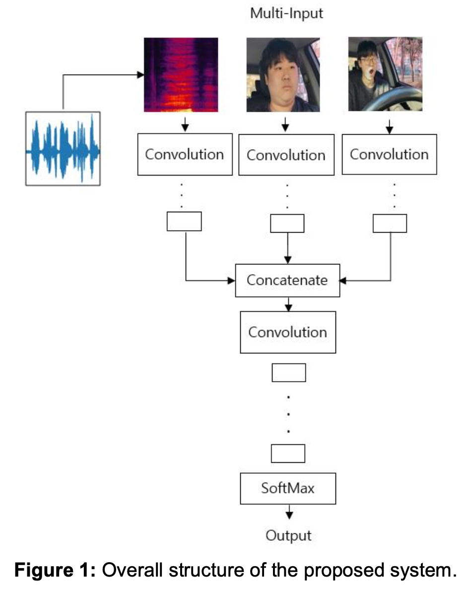
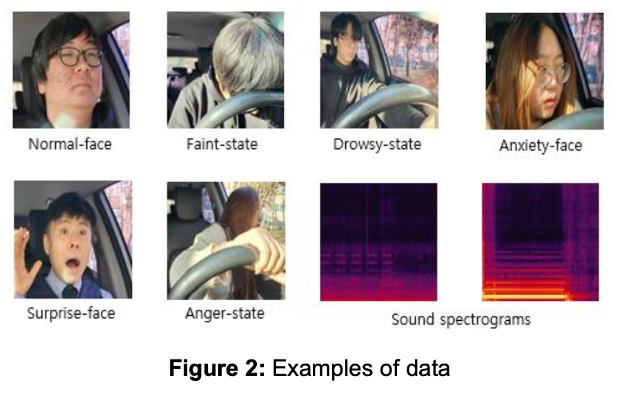
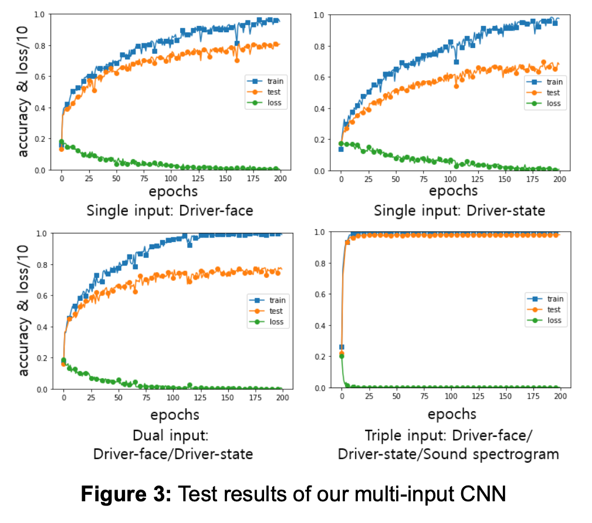

# 🚘 운전자 상태 인식을 위한 CNN 기반 멀티모달 다중 입력 학습 연구
### A Study on Driver State Recognition using CNN-based Multimodal Multi-input Learning

> 운전자의 얼굴, 운전 자세, 주변 소리 데이터를 함께 사용하는 멀티모달(Multimodal) CNN 모델을 통해 운전자의 6가지 상태(정상, 졸음, 기절, 놀람, 분노, 불안)를 99.9%의 높은 정확도로 인식하는 시스템을 제안합니다.

---

## 목차 (Table of Contents)
1. [프로젝트 소개 (About The Project)](#1-프로젝트-소개)
2. [모델 아키텍처 (Model Architecture)](#2-모델-아키텍처)
3. [데이터셋 (Dataset)](#3-데이터셋)
4. [주요 결과 (Results)](#4-주요-결과)
5. [팀원 및 역할 (Team & Roles)](#5-팀원-및-역할)
6. [학술 발표 (Publication)](#6-학술-발표)

---

## 1. 프로젝트 소개 (About The Project)

본 연구는 운전자의 안전을 위해 운전 중 상태를 정확하게 파악하는 것을 목표로 합니다. 기존 연구들이 얼굴 표정이나 생체 신호 등 단일 데이터에 의존했던 것과 달리, 저희는 **세 가지 다른 종류의 데이터를 동시에 활용**하는 멀티모달 접근 방식을 채택했습니다.

*   **Driver Face Image**: 운전자의 얼굴 표정 이미지
*   **Driver State Image**: 운전자의 상반신 자세 이미지
*   **Sound Spectrogram**: 운전자의 목소리 및 주변 소리를 변환한 이미지

이러한 데이터를 통해 on-device AI와 같이 간단한 장치에서도 높은 성능을 낼 수 있는 경량화된 CNN 모델을 개발했으며, 실험을 통해 **99.9%** 라는 높은 분류 정확도를 달성했습니다.  

### 주요 기여 (Key Contributions)
*   얼굴, 자세, 소리 데이터를 동시에 학습하는 **멀티모달 3-input CNN 모델** 제안
*   '정상', '졸음', '기절'과 같은 운전 상태뿐만 아니라 '놀람', '분노', '불안'과 같은 감정 상태까지 포함한 **총 6가지 상태 분류**
*   카메라와 마이크만으로 데이터 수집이 가능하여 **on-device AI 환경에 적용**할 수 있는 간단하고 효율적인 구조 설계

---

## 2. 모델 아키텍처 (Model Architecture)

저희가 제안하는 모델은 3개의 입력 스트림을 가진 CNN 구조입니다. 각 데이터(얼굴, 자세, 소리)는 별도의 컨볼루션 레이어를 통과한 후, 특징(feature)이 하나로 합쳐져(Concatenate) 최종 상태를 분류합니다.

---

## 3. 데이터셋 (Dataset)

실험을 위해 총 6개의 클래스로 구성된 18,900개의 이미지 데이터를 자체적으로 생성했습니다.

*   **학습 데이터**: 12,600장
*   **테스트 데이터**: 6,300장

#### 클래스 구성 (6 Classes)
1.  **정상 (Normal)**: 정면을 주시하는 평온한 상태
2.  **기절 (Faint)**: 핸들에 고개를 숙인 상태
3.  **졸음 (Drowsy)**: 눈을 감거나 하품하는 상태
4.  **놀람 (Surprise)**: 눈과 입을 크게 벌린 상태
5.  **분노 (Anger)**: 화를 내는 표정과 목소리
6.  **불안 (Anxiety)**: 긴장된 표정과 목소리

---

## 4. 주요 결과 (Results)

단일 데이터를 사용했을 때보다 여러 데이터를 함께 사용하는 **멀티모달 방식이 월등히 높은 정확도**를 보였습니다. 특히 3가지 데이터를 모두 사용했을 때 정확도가 **99.9%** 에 도달하며, 본 연구의 가설을 증명했습니다.

| 모델 (Our Multi-input CNN) | 데이터셋 | 정확도 (Accuracy) |
| -------------------------- | ------------------------------------- | :---------------: |
| Single-input               | Driver Face (얼굴)                    |       80.7%       |
| Single-input               | Driver State (자세)                   |       68.6%       |
| Dual-input                 | Driver Face + State (얼굴+자세)       |       75.8%       |
| **Triple-input (제안 모델)**   | **Face + State + Sound (얼굴+자세+소리)** |     **99.9%**     |

#### 학습 과정 (Training Process)

멀티모달(Triple-input) 학습 시, 과적합(overfitting) 없이 안정적으로 높은 테스트 정확도를 달성했습니다.

---

## 5. 팀원 및 역할 (Team & Roles)

| 이름 (Name) | 역할 (Role) |
| :---------- | :--------------------------------------------------------- |
| **강지수**  | 레퍼런스 조사 및 논문 레퍼런스 리스트 작성                 |
| **김수아**  | 레퍼런스 조사 및 논문 레퍼런스 리스트 작성                 |
| **신수아**  | Resnet50 코드 연구 및 실행                                 |
| **여환서**  | Xception 코드 연구 및 실행                                 |
| **이동연**  | 데이터 생성 및 데이터 테이블 제작                          |
| **이정현**  | 데이터 생성 및 데이터 테이블 제작                          |
| **한기준**  | 레퍼런스 조사 및 논문 레퍼런스 리스트 작성                 |

---

## 6. 학술 발표 (Publication)

본 연구 결과는 **Korean Journal of Artificial Intelligence (KJAI)** 에 게재 승인되었습니다.

| 항목 | 내용 |
| :--- | :--- |
| **게재 학회지** | KJAI (Korean Journal of Artificial Intelligence) |
| **논문 제목** | A study on driver state recognition using CNN-based multimodal multi-input learning |
| **상태** | **게재 승인 (Accepted)** |
| **승인일** | 2025년 3월 5일 |

---
